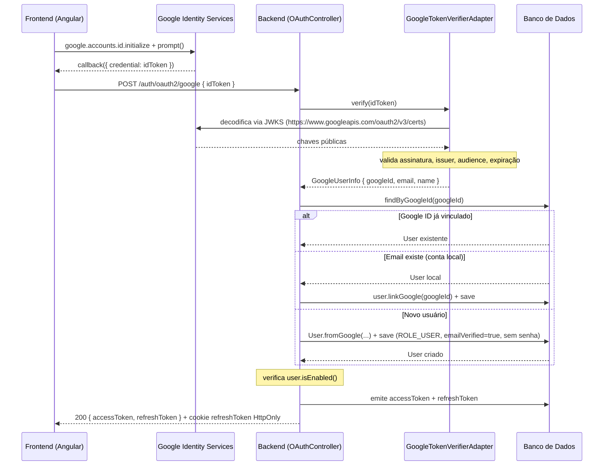

# Fluxos End-to-End

## 1. Login

```
POST /auth/login { username, password }
  │
  ▼
AuthController.login()
  │
  ▼
AuthService.login(username, password)
  │
  ├─► LoginAttemptPort.isLocked(username)
  │     └─ se bloqueado → AccountLockedException (429)
  │
  ├─► CredentialVerifierPort.verify(username, password)
  │     └─► SpringCredentialVerifierAdapter
  │           └─► AuthenticationManager.authenticate()
  │                 ├─► DaoAuthenticationProvider (BCrypt verify)
  │                 └─► CustomUserDetailsService.loadUserByUsername()
  │                       └─► UserRepository.findByUsername() [roles eager loaded]
  │                       └─► [cached por 10 min]
  │     Se falhou → recordFailure(username); lança InvalidPasswordException
  │
  ├─► LoginAttemptPort.recordSuccess(username)  // zera contador de falhas
  │
  ├─► AccessTokenPort.generateFor(username, authorities)
  │     └─► JwtService.generateAccessToken()  [HS256, TTL 15 min]
  │
  └─► RefreshTokenPort.issue(username)
        └─► gera 512-bit random token
        └─► hash SHA-256
        └─► salva RefreshTokenEntity (hash, expiresAt, revoked=false)
        └─► retorna plaintext token ao chamador

◄── 200 { accessToken, refreshToken, tokenType: "Bearer" }
```

---

## 2. Requisição autenticada (JWT)

```
GET /users/me
Authorization: Bearer {accessToken}
  │
  ▼
JwtAuthenticationFilter.doFilterInternal()
  │
  ├─► extrai token do header "Bearer {token}"
  │
  ├─► JwtService.isValid(token)
  │     ├─ valida assinatura HS256
  │     └─ verifica expiração
  │
  ├─► JwtService.extractUsername(token)      → "admin"
  ├─► JwtService.extractIssuedAt(token)      → Instant iat
  │
  ├─► TokenBlocklistPort.isBlockedAt("admin", iat)
  │     └─ se bloqueado → 401 (token emitido antes do logout)
  │
  ├─► CustomUserDetailsService.loadUserByUsername("admin")
  │     └─ [cached; busca no banco se cache miss]
  │
  └─► seta UsernamePasswordAuthenticationToken no SecurityContext
        │
        ▼
  Controller: SecurityContext.getAuthentication().getName() == "admin"

◄── 200 { ...perfil do usuário... }
```

---

## 3. Refresh de token

```
POST /auth/refresh { refreshToken: "opaqueToken" }
  │
  ▼
AuthService.refresh(oldRefreshToken)
  │
  ├─► RefreshTokenPort.rotate(oldRefreshToken)
  │     └─► hash SHA-256 do token recebido
  │     └─► busca RefreshTokenEntity por hash
  │     │
  │     ├─ se revoked=true → REUTILIZAÇÃO DETECTADA:
  │     │     ├─ revokeAll(username)          // todas as sessões
  │     │     ├─ blockAllBefore(username, now) // todos os JWTs
  │     │     └─ lança RefreshTokenAlreadyUsedException (401)
  │     │
  │     ├─ se expirado → RefreshTokenExpiredException (400)
  │     │
  │     └─ se válido:
  │           ├─ marca antigo: revoked=true, rotatedAt=now
  │           ├─ gera novo token (512-bit random)
  │           ├─ hash novo token
  │           ├─ salva novo RefreshTokenEntity
  │           └─ retorna RotationResult { username, newPlaintextToken }
  │
  ├─► UserAuthoritiesPort.loadAuthoritiesByUsername(username)
  │     └─► carrega roles + permissões do usuário
  │
  └─► AccessTokenPort.generateFor(username, authorities)
        └─► novo JWT com iat/exp frescos

◄── 200 { accessToken: novoJwt, refreshToken: novoOpaqueToken }
```

---

## 4. Logout

```
POST /auth/logout { refreshToken: "opaqueToken" }
  │
  ▼
AuthService.logout(refreshToken)
  │
  ├─► RefreshTokenPort.revoke(refreshToken)
  │     └─► hash SHA-256
  │     └─► marca revoked=true
  │     └─► retorna Optional<username>
  │
  └─► se encontrou username:
        TokenBlocklistPort.blockAllBefore(username, now)
          └─ registra threshold: agora
          └─ próximas validações de JWTs com iat ≤ threshold retornam bloqueado

◄── 204 (sem corpo)
```

---

## 5. Registro + Verificação de email + Login

```
PASSO 1 — Registro

POST /auth/register { username, password, email }
  │
  ▼
UserService.registerUser(username, password, email, [])
  │
  ├─► valida complexidade de senha
  ├─► verifica unicidade de username e email
  │
  ├─► cria User.ofPendingVerification(username, hash, email, [])
  │     └─ enabled=false, emailVerified=false
  │
  ├─► UserRepository.save(user)
  │
  ├─► gera código: 12 chars alfanuméricos
  ├─► hash SHA-256 do código
  ├─► EmailVerificationCodeRepository.save(username, code, now+15min)
  │
  └─► EmailPort.sendVerificationCode(email, username, plaintextCode)
        Dev: LoggingEmailAdapter  → loga no console + retém em memória
        Prod: ResendEmailAdapter  → chama API Resend.com

◄── 201 (conta criada, aguardando verificação)


PASSO 2 — Verificação de email

POST /auth/verify-email { code: "Abc123Def456" }
  │
  ▼
UserService.verifyEmail(code)
  │
  ├─► hash SHA-256 do código recebido
  ├─► EmailVerificationCodeRepository.findByCode(hash)
  │     └─ não encontrado → EmailVerificationCodeNotFoundException (400)
  │
  ├─► verifica expiração
  │     └─ expirado → EmailVerificationCodeExpiredException (400)
  │
  ├─► carrega User pelo username do registro
  │
  ├─► verifica user.isEmailVerified()
  │     └─ já verificado → EmailAlreadyVerifiedException (409 EMAIL_ALREADY_VERIFIED)
  │       (permite ao frontend distinguir "já verificado — redirecionar ao login"
  │        de "código inválido — pedir novo código")
  │
  ├─► ATÔMICO: EmailVerificationCodeRepository.markAsUsed(code)
  │     └─► UPDATE ... WHERE code=? AND used=false
  │     └─ retorna false se já foi usado (concurrent claim) → EmailVerificationCodeExpiredException
  │
  ├─► user.confirmEmail()   → enabled=true, emailVerified=true
  ├─► UserRepository.save(user)
  └─► UserCachePort.evict(username)
      (códigos usados são limpos periodicamente pelo EmailVerificationCodeCleanupService, não aqui)

◄── 204 (conta habilitada, pode fazer login)
◄── 409 EMAIL_ALREADY_VERIFIED (conta já estava ativa)


PASSO 3 — Login normal (veja fluxo 1)

POST /auth/login { username, password }
◄── 200 { accessToken, refreshToken }
```

---

## 6. Troca de senha

```
PUT /users/me/password { currentPassword, newPassword, totpCode?, revokeOtherSessions? }
  │
  ▼
UserService.changeOwnPassword(username, currentPassword, newPassword, totpCode, revokeOtherSessions)
  │
  ├─► valida complexidade de newPassword
  │
  ├─► carrega User pelo username
  ├─► PasswordHashPort.matches(currentPassword, user.password)
  │     └─ falhou → InvalidPasswordException (400)
  │
  ├─► TwoFactorAuthPort.isEnabled(username)
  │     └─ se true:
  │           ├─► totpCode vazio → TotpCodeRequiredException (400)
  │           └─► TwoFactorAuthPort.validateTotpCode(username, totpCode)
  │                 └─ inválido → InvalidTotpCodeException (400)
  │
  ├─► PasswordHashPort.hash(newPassword)
  ├─► user.changePassword(hash)
  ├─► UserRepository.save(user)
  ├─► UserCachePort.evict(username)
  │
  └─► se revokeOtherSessions == true:
        ├─► RefreshTokenPort.revokeAll(username)
        └─► TokenBlocklistPort.blockAllBefore(username, now)

◄── 204
```

---

## 7. Login com Google (OAuth2)



```
POST /auth/oauth2/google { "idToken": "eyJ..." }
  │
  ▼
OAuthController.loginWithGoogle()
  │
  ├─► OAuthLoginUseCase.loginWithGoogle(idToken)
  │     │
  │     ├─► GoogleTokenVerifierPort.verify(idToken)
  │     │     └─► GoogleTokenVerifierAdapter
  │     │           └─► NimbusJwtDecoder (JWKS Google)
  │     │               ├─ valida assinatura
  │     │               ├─ valida issuer = https://accounts.google.com
  │     │               ├─ valida audience = GOOGLE_CLIENT_ID
  │     │               └─ valida expiração
  │     │           Se inválido → OAuthTokenInvalidException (401)
  │     │           Se válido  → GoogleUserInfo { googleId, email, name }
  │     │
  │     ├─► resolveUser(googleInfo)
  │     │     ├─ email normalizado: lowercase + strip
  │     │     │
  │     │     ├─► UserRepository.findByGoogleId(googleId)
  │     │     │     └─ encontrado → retorna User (login direto)
  │     │     │
  │     │     ├─► UserRepository.findByEmail(normalizedEmail)
  │     │     │     └─ encontrado → user.linkGoogle(googleId); UserRepository.save(); evict cache
  │     │     │
  │     │     └─ não encontrado → User.fromGoogle(googleId, username, email, [ROLE_USER])
  │     │           └─► UserRepository.save()
  │     │           └─► UserCachePort.evict(username)
  │     │
  │     ├─► verifica user.isEnabled()
  │     │
  │     ├─► UserAuthoritiesPort.loadAuthoritiesByUsername(username)
  │     ├─► AccessTokenPort.generateFor(username, authorities)
  │     └─► RefreshTokenPort.issue(username)
  │
  ├─► publica AuditEvent(OAUTH_GOOGLE_LOGIN, username)
  └─► Set-Cookie: refreshToken HttpOnly Path=/auth

◄── 200 { accessToken, refreshToken, tokenType: "Bearer", expiresIn: 900 }
```

---

## 8. Cleanup de tokens expirados (scheduler)

```
Cron: 0 0 3 * * *  (3 AM diário)
  │
  ▼
RefreshTokenCleanupService (ShedLock — executa em apenas 1 instância)
  │
  └─► RefreshTokenPort.deleteExpiredAndRevoked()
        └─► DELETE FROM refresh_tokens WHERE (expires_at < now OR revoked=true)
```

Outros schedulers com ShedLock:

| Scheduler | Cron padrão | O que limpa |
|-----------|-------------|-------------|
| `AuditLogCleanupService` | 3:45 AM | Audit logs > `audit.retention-days` (padrão 365 dias) |
| `EmailVerificationCodeCleanupService` | 3:30 AM | Códigos de verificação expirados |
| `PasswordResetTokenCleanupService` | 3:15 AM | Tokens de reset expirados |
| `TotpChallengeCleanupService` | 3:30 AM | Challenge tokens expirados |
| `TotpPendingSetupCleanupService` | 3:45 AM | Setups de 2FA não confirmados > `totp.pending-setup.ttl-hours` (padrão 24h) |

---

## 9. Setup de 2FA (TOTP)

```mermaid
sequenceDiagram
    participant FE as Frontend
    participant BE as TotpController
    participant SVC as TotpService
    participant DB as Banco

    FE->>BE: GET /auth/2fa/status  [Bearer token]
    BE-->>FE: { "enabled": false }

    FE->>BE: POST /auth/2fa/setup  [Bearer token]
    BE->>SVC: setup(username)
    SVC->>SVC: gera secret BASE32
    SVC->>SVC: cifra com AES-256 (TotpEncryptionPort)
    SVC->>DB: TotpConfigRepository.save(username, secretEncrypted)
    Note over DB: enabled=false, confirmedAt=null
    SVC-->>BE: TotpSetupResult { secret, otpauthUri }
    BE-->>FE: 200 { secret, otpauthUri }

    Note over FE: Renderiza QR code a partir do otpauthUri
    Note over FE: Usuário escaneia com app autenticador

    FE->>BE: POST /auth/2fa/confirm { code: "123456" }
    BE->>SVC: confirm(username, code)
    SVC->>DB: findByUsername → TotpConfig (enabled=false)
    SVC->>SVC: decifra secret; valida código TOTP
    SVC->>DB: TotpConfigRepository.enable(username, confirmedAt=now)
    SVC->>SVC: gera 8 backup codes → hash SHA-256
    SVC->>DB: TotpBackupCodeRepository.saveAll(username, rawCodes)
    SVC-->>BE: List<String> backupCodes (texto puro)
    BE->>BE: publica AuditEvent(TOTP_ENABLED, username)
    BE-->>FE: 200 { backupCodes: ["ABCD-1234-EF56", ...] }

    Note over FE: Exibe backup codes — guardar agora (exibidos uma única vez)
```

```
POST /auth/2fa/setup  [Bearer token]
  │
  ▼
TotpService.setup(username)
  │
  ├─► verifica se 2FA já está ativo → TotpAlreadyEnabledException (409)
  ├─► gera secret: 160-bit Base32 aleatório
  ├─► TotpEncryptionPort.encrypt(secret)
  │     └─► AesEncryptionAdapter  → AES-256-GCM
  ├─► TotpConfigRepository.save(username, secretEncrypted)
  └─► retorna { secret, otpauthUri: "otpauth://totp/..." }

◄── 200 { secret, otpauthUri }

POST /auth/2fa/confirm { code }  [Bearer token]
  │
  ▼
TotpService.confirm(username, totpCode)
  │
  ├─► TotpConfigRepository.findByUsername → config (enabled=false)
  ├─► TotpEncryptionPort.decrypt(config.secretEncrypted)
  ├─► valida código TOTP de 6 dígitos (janela ±1 step)
  │     └─ inválido → InvalidTotpCodeException (400)
  ├─► TotpConfigRepository.enable(username, now)  → enabled=true
  ├─► TotpBackupCodeRepository.deleteByUsername (limpa eventuais anteriores)
  ├─► gera 8 backup codes: "XXXX-XXXX-XXXX" ([A-Z0-9], 12 chars)
  ├─► hash SHA-256 de cada code
  ├─► TotpBackupCodeRepository.saveAll(username, rawCodes)
  └─► retorna lista de 8 codes em texto puro

◄── 200 { backupCodes: [...] }
```

---

## 10. Login com 2FA ativo

```
POST /auth/login { username, password }
  │
  ▼
AuthService.login(username, password)
  │
  ├─► (mesma validação de credenciais do fluxo 1)
  │
  ├─► TwoFactorAuthPort.isEnabled(username)  → true
  │
  ├─► TwoFactorAuthPort.issueChallengeToken(username)
  │     └─► gera 512-bit random token
  │     └─► hash SHA-256
  │     └─► TotpChallengeTokenRepository.save(username, rawToken, now+5min)
  │     └─► retorna rawToken (plaintext)
  │
  └─► retorna LoginResponse.twoFactorChallenge(challengeToken)

◄── 200 { status: "PENDING_2FA", challengeToken, expiresInSeconds: 300 }

POST /auth/2fa/verify { challengeToken, code }   (sem Bearer — público)
  │
  ▼
AuthService.completeTwoFactorLogin(challengeToken, code)
  │
  ├─► TwoFactorAuthPort.completeChallengeLogin(challengeToken, code)
  │     ├─► hash SHA-256 do challengeToken recebido
  │     ├─► TotpChallengeTokenRepository.findByToken(hash)
  │     │     └─ não encontrado → TotpChallengeExpiredException (401)
  │     ├─► verifica expiração → TotpChallengeExpiredException (401)
  │     ├─► CAS markAsUsed → evita duplo uso concorrente
  │     │
  │     ├─► tenta validar como código TOTP (6 dígitos):
  │     │     ├─► TotpConfigRepository.findByUsername → config
  │     │     ├─► TotpEncryptionPort.decrypt(secretEncrypted)
  │     │     └─► valida código com janela ±1 step
  │     │
  │     └─► se TOTP inválido, tenta como backup code (XXXX-XXXX-XXXX):
  │           ├─► TotpBackupCodeRepository.findByCode(hash)
  │           ├─► verifica isUsed → InvalidTotpCodeException se já usado
  │           └─► CAS markAsUsed → InvalidTotpCodeException se concorrente
  │
  │     Se nenhum válido → InvalidTotpCodeException (400)
  │     Retorna username
  │
  ├─► UserAuthoritiesPort.loadAuthoritiesByUsername(username)
  ├─► AccessTokenPort.generateFor(username, authorities)
  └─► RefreshTokenPort.issue(username)

◄── 200 { accessToken, refreshToken, tokenType: "Bearer", expiresIn: 900 }
```

---

## 11. Reset de senha

```
PASSO 1 — Solicitar reset

POST /auth/forgot-password { email }
  │
  ▼
UserService.requestPasswordReset(email)
  │
  ├─► UserRepository.findByEmail(email)
  │     └─ não encontrado → retorna silenciosamente (sem disclosure)
  │
  ├─► gera token: 512-bit random, encoded Base64 URL-safe
  ├─► hash SHA-256 do token
  ├─► PasswordResetTokenRepository.save(username, rawToken, now+30min)
  └─► EmailPort.sendPasswordResetLink(email, username, resetLink)
        Dev: LoggingEmailAdapter  → loga no console
        Prod: ResendEmailAdapter  → chama API Resend.com (assíncrono)

◄── 204 (sempre — sem disclosure de email)


PASSO 2 — Redefinir senha

POST /auth/reset-password { token, newPassword }
  │
  ▼
UserService.resetPassword(token, newPassword)
  │
  ├─► hash SHA-256 do token recebido
  ├─► PasswordResetTokenRepository.findByToken(hash)
  │     └─ não encontrado → PasswordResetTokenNotFoundException (400)
  │
  ├─► verifica expiração → PasswordResetTokenExpiredException (400)
  │
  ├─► CAS: PasswordResetTokenRepository.markAsUsed(rawToken)
  │     └─ retorna false se concorrente → PasswordResetTokenExpiredException
  │
  ├─► carrega User pelo username
  ├─► valida complexidade de newPassword
  ├─► PasswordHashPort.hash(newPassword)
  ├─► user.changePassword(hash)
  ├─► UserRepository.save(user)
  │
  ├─► RefreshTokenPort.revokeAll(username)        // encerra todas as sessões
  ├─► TokenBlocklistPort.blockAllBefore(username, now)
  └─► UserCachePort.evict(username)

◄── 204
```

---

## 12. Troca de email

```
PASSO 1 — Solicitar troca (próprio usuário)

PATCH /users/me { username, email: "novo@email.com", currentPassword }
  │
  ▼
UserService.updateOwnProfile(username, newUsername, newEmail, currentPassword)
  │
  ├─► verifica unicidade de username (se alterado)
  ├─► verifica unicidade de newEmail
  │
  ├─► valida currentPassword (obrigatório ao trocar email)
  │     └─ inválido → InvalidPasswordException (400)
  │
  ├─► user.setPendingEmail(newEmail)   // não altera email atual
  ├─► UserRepository.save(user)
  │
  ├─► gera código: 12 chars alfanuméricos
  ├─► hash SHA-256 do código
  ├─► EmailVerificationCodeRepository.save(username, code, now+15min)
  └─► EmailPort.sendEmailChangeNotification(oldEmail, username, newEmail)
        └─► envia código ao NOVO endereço

◄── 200 UserProfileDTO { ..., pendingEmail: "novo@email.com" }
    (email ainda = email atual; pendingEmail = novo email aguardando confirmação)


PASSO 2 — Confirmar troca

POST /auth/confirm-email-change { code: "ABC123DEF456" }   (público)
  │
  ▼
UserService.confirmEmailChange(code)
  │
  ├─► hash SHA-256 do código
  ├─► EmailVerificationCodeRepository.findByCode(hash)
  │     └─ não encontrado → EmailVerificationCodeNotFoundException (400)
  │
  ├─► verifica expiração → EmailVerificationCodeExpiredException (400)
  │
  ├─► CAS: EmailVerificationCodeRepository.markAsUsed(code)
  │     └─ false se concorrente → EmailVerificationCodeExpiredException
  │
  ├─► carrega User pelo username
  ├─► user.applyPendingEmail()   // email = pendingEmail; pendingEmail = null
  ├─► UserRepository.save(user)
  ├─► EmailVerificationCodeRepository.deleteByUsername(username)
  └─► UserCachePort.evict(username)

◄── 204
```

---

## 13. Elevação DEV (duplo TOTP consecutivo)

O acesso à área de desenvolvedor exige dois códigos TOTP de **períodos consecutivos** (T e T+1). O usuário precisa ter `ROLE_DEV` e 2FA ativo.

```
ETAPA 1 — Primeiro código TOTP (período T)

POST /auth/dev/first-code
Authorization: Bearer <accessToken com ROLE_DEV>
{ "totpCode": "123456" }
  │
  ▼
DevAuthController.firstCode()
  │  [protegido por @PreAuthorize("hasAuthority('ROLE_DEV')")]
  │
  ▼
TotpService.issueDevFirstCode(username, "123456")
  │
  ├─► TotpConfigRepository.findByUsername(username)
  │     └─ não encontrado ou disabled → TotpNotEnabledException (400)
  │
  ├─► decifra secret via TotpEncryptionPort
  ├─► CodeVerifier.isValidCode(secret, "123456")
  │     └─ inválido → InvalidTotpCodeException (400)
  │
  ├─► periodT = Instant.now().epochSecond / 30
  ├─► gera rawDevToken (256-bit random, Base64 URL-safe)
  ├─► DevChallengeRepository.save(username, rawDevToken, periodT, now+90s)
  └─► retorna rawDevToken

◄── 200 { devToken: "...", expiresIn: 90 }

[usuário aguarda o próximo código aparecer no app — até 30s]


ETAPA 2 — Segundo código TOTP (período T+1)

POST /auth/dev/complete   [público — devToken é a prova de identidade]
{ "devToken": "...", "totpCode": "654321" }
  │
  ▼
AuthService.completeDevElevation(rawDevToken, "654321")
  │
  ▼
TotpService.completeDevChallenge(rawDevToken, "654321")
  │
  ├─► DevChallengeRepository.findByToken(rawDevToken)
  │     └─ não encontrado → DevChallengeExpiredException (410)
  │
  ├─► challenge.isExpired() || challenge.isUsed()
  │     └─ expirado/usado → DevChallengeExpiredException (410)
  │
  ├─► currentPeriod = Instant.now().epochSecond / 30
  ├─► currentPeriod != periodT + 1
  │     └─ mesmo período ou >1 atrás → TotpNotConsecutiveException (400)
  │
  ├─► decifra secret; CodeVerifier.isValidCode(secret, "654321")
  │     └─ inválido → InvalidTotpCodeException (400)
  │
  ├─► DevChallengeRepository.consume(rawDevToken)   ← CAS atômico
  │     └─ false se concorrente → DevChallengeExpiredException (410)
  │
  └─► retorna username

  │
  ▼
AuthService (continuação)
  │
  ├─► UserAuthoritiesPort.loadAuthoritiesByUsername(username)
  ├─► authorities.add("DEV_ELEVATED")  // injetado dinamicamente — não está no banco
  └─► AccessTokenPort.generateFor(username, authorities)  // TTL 1h, sem refresh token

DevAuthController publica AuditEvent(DEV_ELEVATION_COMPLETED, username)

◄── 200 { accessToken: "eyJ...", tokenType: "Bearer", expiresIn: 3600 }
```

**Invariante de consecutividade:** o backend valida `currentPeriod == periodT + 1` no momento exato da chamada. Se o usuário chamar a etapa 2 no mesmo período T ou em T+2 ou posterior, recebe `400 TOTP_NOT_CONSECUTIVE` e precisa reiniciar do início.

**Sem refresh token:** o token DEV-elevado expira em 1h e não pode ser renovado — o frontend deve monitorar a expiração (`devTokenExpiresAt` no `AuthStore`) e solicitar nova elevação quando necessário.
